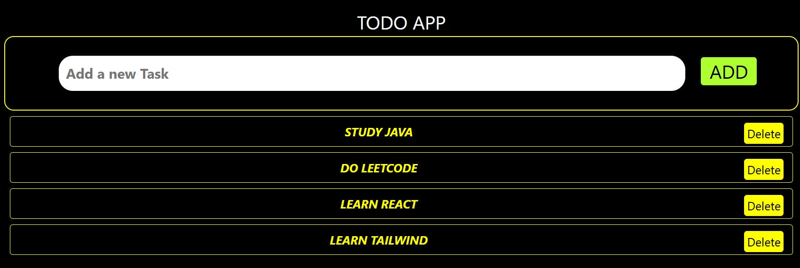

<div align="center">

# 📝 REACT TODO LIST
### *Efficient Task Management through Component-Driven Design*

[](https://react.dev/)
[](https://developer.mozilla.org/en-US/docs/Web/JavaScript)
[](https://developer.mozilla.org/en-US/docs/Web/CSS)

**A lightweight, intuitive application designed to help users organize their daily tasks with real-time updates.**
</div>

---

## 📖 Overview
The **React Todo List** is a foundational project that explores the core mechanics of the React library. It focuses on maintaining a "Single Source of Truth" by managing the task state in a central component and distributing data and functions to specialized sub-components.

---

## Preview



## 🏗️ Architecture & Component Logic
The application is structured to follow the **Unidirectional Data Flow** pattern:

* **`Todo.js` (Container):** Acts as the brain of the app, holding the state for all tasks and defining functions for adding and deleting items.
* **`AddTask.js`:** A controlled component that captures user input and triggers the state update in the parent.
* **`ListTasks.js`:** Responsible for mapping through the task array and rendering each individual task item efficiently.


---

## ✨ Key Features
* **⚡ State Lifting:** Efficiently shares data between sibling components via the parent container.
* **🎨 Dynamic Rendering:** Instantly updates the UI when tasks are added or removed without page refreshes.
* **📱 Responsive Styling:** A minimalist design that adapts seamlessly to both desktop and mobile views.
* **🛠️ Controlled Inputs:** Utilizes React state to manage form data for better validation and control.

---

## 💻 Tech Stack
| Component | Technology |
| :--- | :--- |
| **Library** | React.js |
| **State Management** | React Hooks (`useState`) |
| **Styling** | CSS3 (Modular Styles) |
| **Environment** | Node.js / npm |

---

## 🚦 Getting Started

### Installation
1. **Clone the repository:**
   ```bash
   git clone [https://github.com/faizal08/REACT-TODO-LIST.git](https://github.com/faizal08/REACT-TODO-LIST.git)
``
2.Navigate to the directory:

```bash
cd REACT-TODO-LIST
```

3.Install dependencies:

```bash
npm install
```

4.Run the application:

```bash
npm start
```


## 📧 Contact
- *Developer:* [Faizal](https://github.com/faizal08)
- *Email:* [reachfaizal08@gmail.com](mailto:reachfaizal08@gmail.com)
